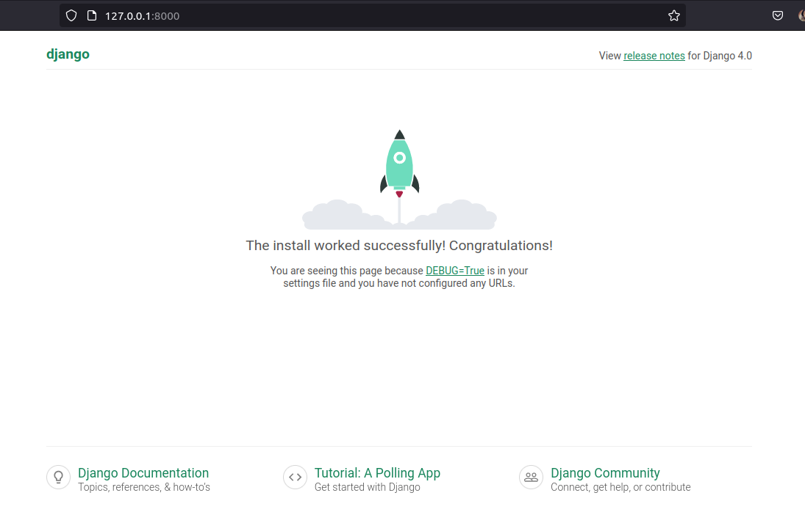

# Creating a project with Django using Docker and PostgreSQL
- [x] You should have Docker Installed. (Further I will upload steps on how to do so in linux, sorry Windows users :/ )
- [x] Create a file for your project: 
  ```bash
  $ mkdir django-docker && cd django-docker
  ```

- [x] Create a virtual environment and **activate it**.
  ```bash
  $ virtualenv env
  $ source env/bin/activate
  ```
  
- [x] Install Django
  ```bash 
  (env)$ python3 -m pip install django~=4.0.0
  ```
- [x] Create a django project, migrate and runserver
  ```bash
  (env) $ django-admin startproject django_project .
  (env) $ python manage.py migrate
  (env) $ python manage.py runserver
  ```
  ### Why is it needed to migrate if we have not created anything yet? 
  Django has a series of tables that need to be  migrated in order to be able to acces to admin, for example. And create a default users model that comes with it.
  You should expect something like the following:
    - In your console:
      ```b
      Watching for file changes with StatReloader
      Performing system checks...

      System check identified no issues (0 silenced).
      March 10, 2023 - 17:34:21
      Django version 4.0.10, using settings 'poll_project.settings'
      Starting development server at http://127.0.0.1:8000/
      Quit the server with CONTROL-C.
      ```

    - In your browser write:
    
      - `http://127.0.0.1:8000/` and something like this should appear:
      
      
  
    - With `ctrl+c` you can stop the server, we just wanted to see everyhting is running.

- [x] Pip freeze to get all the requirements to run django inside docker.
  ```bash
  pip freeze > requirements.txt
  ```
  and deactivate `env`
  ```bash
  (env)$ deactivate
  ```
## Time to write the Dockerfile to create an image
Create a `Dockerfile` (yes, without any extension) at the same level of `manage.py`.

```Dockerfile
# Pull base image
FROM python:3.10.2-slim-bullseye

# Set environment variables
ENV PIP_DISABLE_PIP_VERSION_CHECK 1
ENV PYTHONDONTWRITEBYTECODE 1
ENV PYTHONUNBUFFERED 1

# Set work directory
WORKDIR /code

# Install dependencies
COPY ./requirements.txt .
RUN pip install -r requirements.txt

# Copy project
COPY . .
```

Create `.dockerignore`:

```
env
images
.git
.gitignore
db.sqlite3
```

The following command will create an image with the name `name_you_want`

```bash
$ docker build -t name_you_want .
                                ^---- notice the dot (.)
```

Write `docker-compose.yml`:

```yml
version: "3.9"
services:
  web:
    build: .
    ports:
      - "8000:8000"
    command: python manage.py runserver 0.0.0.0:8000
    volumes:
      - .:/code
```
Then run:
```bash
$ docker-compose up
```
##### _If you are eager to understand what does `docker-compose up` do, you can go [here](#why-dockerfile-is-important-and-what-does-everything-inside-it-mean)_

You can enter to `https://127.0.0.1:8000` and see docker running :)
  - Again this:
    

But now if we want to connect django with postgres we should add some interpreter to work with it from django to postgres datbase. For that, we will need `psycopg2-binary` so:

  - Edit `./requirements.txt` to add `psycopg2-binary==2.9.3`


Edit `docker-compose.yml`

Change `DATABASES` in `your_project/settings.py`

  - From this:
  ```py
  DATABASES = {
    "default": {
        "ENGINE": "django.db.backends.sqlite3",
        "NAME": BASE_DIR / "db.sqlite3",
    }
  }
  ```
  - To this:
  ```py
  DATABASES = {
    "default": {
        "ENGINE": "django.db.backends.postgresql",
        "NAME": "postgres",
        "USER": "postgres",
        "PASSWORD": "postgres",
        "HOST": "db",  # set in docker-compose.yml
        "PORT": 5432,  # default postgres port
    }
  }
  ```

Then this:
  ```bash
  $ docker-compose up -d --build
  ```

# It took more than 5 minutes of refreshing to see the project running, so BE PATIENT!

To excecute something inside the docker-compose (which contains web and db) you just have to write:
```bash
$ docker-compose exec [commands]
```


- For example, to migrate the default models that come with django:
```bash
$ docker-compose exec web python manage.py migrate
```
- To create superuser:
```bash
$ docker-compose exec web python manage.py createsuperuser
```

remember: close Docker containers.
In other context, if you had run a single container namely: 'container-1', you should use:
```bash
docker stop container-1 (or its first 4 ID's digits)
```
In this context, we have a docker-compose running so we have to write:

```bash
docker-compose down
```
--- 
Short breakup:
## Why Dockerfile is important and what does everything inside it mean?

- [] Yet to answer

## What docker-compose up does?
> I would like to make it easier to understand since it took me weeks to figure out what is the purpose of docker compose. 

> So far I know that each service (it is: django app and postgres database in our case) runs in a single container. So for django app we should have a container and for postgres a different one. What docker-compose does is to create a container for each service and then connect them so that they can work together for any purpose you want. 

> This connection can be done since  when you run `docker-compose up`, one of the steps this command do is to internally create a network. You can see the network that has been created after running `docker-compose up` with:
```bash
$ docker network ls
```
>And there should be a network with the name of the folder where your `docker-compose.yml` is located

>Say:
```
folder_name
  | - docker-compose.yml
```
>The network should be called: `folder_name_default`

>Also, if you do:
```bash
$ docker ps
# You should see two containers with the names:
  CONTAINER ID   IMAGE                ...         
  08429e0da68d   django-project_web   ...
  9c125f0e2165   postgres:13          ...
```

>So that means our TWO containers are connected by a network, everything in docker, not installing any postgres in our machine :relieved: .

> ## Later I will explain every line of `docker-compose.yml`

---
